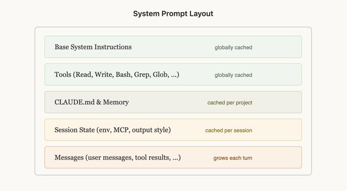
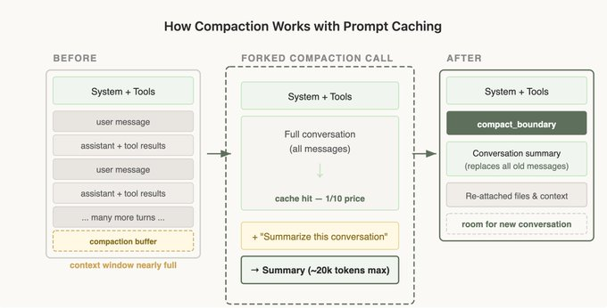

# 构建 Claude Code 的经验教训：提示缓存就是一切

人们常说，在工程领域"缓存支配着我周围的一切"，这条规则同样适用于agent。

像 Claude Code 这样长期运行的agent产品之所以可行，是因为提示缓存使我们能够复用之前往返计算的结果，显著降低延迟和成本。

什么是提示缓存，它是如何工作的，以及如何在技术上实现它？阅读 @RLanceMartin 关于提示缓存的文章以及我们新发布的自动缓存功能了解更多。

在 Claude Code 中，我们围绕提示缓存构建了整个架构。高提示缓存命中率可以降低成本，并帮助我们为订阅计划创建更宽松的速率限制，因此我们会对提示缓存命中率运行告警，并在命中率过低时宣布 SEV。

以下是我们在大规模优化提示缓存时学到的（常常违反直觉的）经验教训。

## 为缓存设计你的提示

提示缓存通过前缀匹配工作——API 会从请求开头缓存所有内容，直到每个 cache_control 断点。这意味着你放置内容的顺序非常重要，你希望尽可能多的请求共享相同的前缀。

做到这一点的最佳方式是静态内容在前，动态内容在后。对于 Claude Code，这看起来是这样的：

1. 静态系统提示和工具（全局缓存）
2. Claude.MD（在项目内缓存）
3. 会话上下文（在会话内缓存）
4. 对话消息

这样我们最大化了共享缓存命中的会话数量。

但这可能出奇地脆弱！我们以前破坏这种排序的例子包括：在静态系统提示中放置详细的时间戳、非确定性地打乱工具顺序定义、更新工具参数（例如 AgentTool 可以调用哪些agent）等。

## 使用消息进行更新

有时你放在提示中的信息可能会过时，例如如果你有时间信息，或者用户更改了文件。你可能很想更新提示，但这会导致缓存未命中，最终可能对用户来说相当昂贵。

考虑是否可以在下一轮通过消息传递这些信息。在 Claude Code 中，我们在下一条用户消息或工具结果中添加一个 <system-reminder> 标签，其中包含更新后的信息（例如现在是周三），这有助于保留缓存。

## 不要在会话中途更换模型

提示缓存是模型独有的，这会使提示缓存的计算变得相当违反直觉。

如果你在使用 Opus 进行 10 万 token 的对话后，想询问一个相当容易回答的问题，实际上切换到 Haiku 会比让 Opus 回答更昂贵，因为我们需要为 Haiku 重建提示缓存。

如果你需要切换模型，最好的方式是使用subagent，Opus 会准备一条"交接"消息给另一个模型，说明它需要完成的任务。我们在 Claude Code 中经常使用 Explore agent来实现这一点，这些agent使用 Haiku。

## 绝不要在会话中途添加或移除工具

在对话中途更改工具集是人们破坏提示缓存最常见的方式之一。这看起来很直观——你应该只给模型它现在需要的工具。但由于工具是缓存前缀的一部分，添加或移除工具会使整个对话的缓存失效。

### 计划模式——围绕缓存进行设计

计划模式是围绕缓存约束设计功能的绝佳例子。直观的做法是：当用户进入计划模式时，将工具集替换为只包含只读工具。但这会破坏缓存。

相反，我们始终在请求中保留所有工具，并将 EnterPlanMode 和 ExitPlanMode 本身作为工具。当用户切换计划模式开启时，agent会收到一条系统消息，解释它处于计划模式以及指令是什么——探索代码库、不要编辑文件、在计划完成后调用 ExitPlanMode。工具定义永远不会改变。

这有一个额外的好处：因为 EnterPlanMode 是模型可以自己调用的工具，它可以在检测到难题时自主进入计划模式，而不会破坏任何缓存。

### 工具搜索——延迟加载而非移除

同样的原则适用于我们的工具搜索功能。Claude Code 可以加载数十个 MCP 工具，在每次请求中都包含它们会很昂贵。但在对话中移除它们会破坏缓存。

我们的解决方案：defer_loading。我们不是移除工具，而是发送轻量级存根——只有工具名称，带有 defer_loading: true——模型可以通过 ToolSearch 工具在需要时"发现"它们。完整的工具模式只在模型选择它们时才加载。这保持了缓存前缀的稳定：相同的存根始终以相同的顺序存在。

幸运的是，你可以通过我们的 API 使用工具搜索工具来简化这一点。

## 分叉上下文——压缩

压缩是指当你用完上下文窗口时发生的情况。我们总结到目前为止的对话，并用该摘要继续一个新会话。

令人惊讶的是，压缩有许多与提示缓存相关的边界情况，这些情况可能违反直觉。

特别是，当我们压缩时，我们需要将整个对话发送给模型以生成摘要。如果这是一个单独的 API 调用，使用不同的系统提示且没有工具（这是简单的实现方式），主对话的缓存前缀完全不匹配。你要为所有这些输入 token 支付全价，大幅增加了用户的成本。

### 解决方案——缓存安全的分叉

当我们运行压缩时，我们使用与父对话完全相同的系统提示、用户上下文、系统上下文和工具定义。我们前置父对话的对话消息，然后将压缩提示作为新的用户消息附加在末尾。

从 API 的角度来看，这个请求看起来与父对话的最后一个请求几乎完全相同——相同的前缀、相同的工具、相同的历史——因此缓存的前缀被复用。唯一的新 token 是压缩提示本身。

然而，这确实意味着我们需要保存一个"压缩缓冲区"，以便在上下文窗口中有足够的空间来包含压缩消息和摘要输出 token。

压缩很棘手，但幸运的是，你不需要自己学习这些经验——基于我们从 Claude Code 中学到的经验，我们直接将压缩构建到 API 中，因此你可以在自己的应用中应用这些模式。

## 经验教训

1. 提示缓存是前缀匹配。前缀中任何位置的任何更改都会使其后的所有内容失效。围绕这一约束设计你的整个系统。把顺序弄对，大部分缓存就能免费工作。
2. 使用消息而不是更改系统提示。你可能很想编辑系统提示来做一些事情，比如进入计划模式、更改日期等，但实际上在对话中插入这些内容会更好。
3. 不要在对话中途更改工具或模型。使用工具来建模状态转换（如计划模式），而不是更改工具集。延迟加载工具而不是移除工具。
4. 像监控正常运行时间一样监控你的缓存命中率。我们对缓存破坏发出告警，并将它们视为事故。几个百分点的缓存未命中率会显著影响成本和延迟。
5. 分叉操作需要共享父级的前缀。如果你需要运行旁路计算（压缩、摘要、技能执行），使用相同的缓存安全参数，这样你就能在父级前缀上获得缓存命中。

Claude Code 从一开始就是围绕提示缓存构建的，如果你正在构建agent，你也应该这样做。
