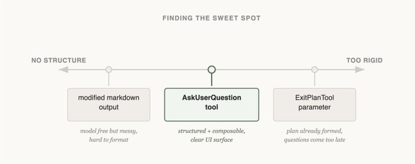
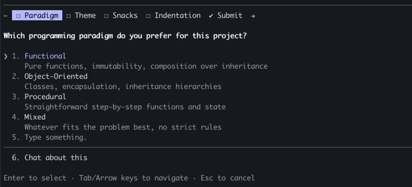
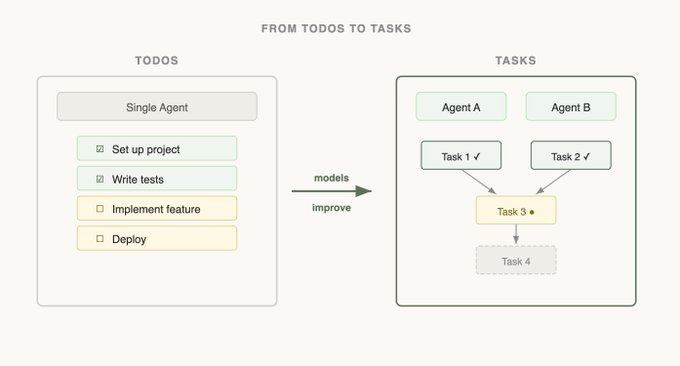

# 构建 Claude Code 的经验教训：像agent一样思考

Thariq@trq212

构建agent架构最困难的部分之一是构建其动作空间。

Claude 通过工具调用来执行操作，但在 Claude API 中有多种方式可以构建工具，使用诸如 bash、技能和最近的代码执行等原语（阅读 @RLanceMartin 的新文章了解更多关于 Claude API 上程序化工具调用的内容）。

鉴于所有这些选项，你如何设计agent的工具？你是只需要一个工具，比如代码执行或 bash？如果你有 50 个工具呢，每个工具对应你的agent可能遇到的每种用例？

为了让自己置身于模型的思维中，我喜欢想象被给了一个困难的数学问题。你会想要什么工具来解决它？这取决于你自己的技能！

纸是最低限度的，但你会受到手工计算的限制。计算器会更好，但你需要知道如何操作更高级的选项。最快和最强大的选项是计算机，但你必须知道如何使用它来编写和执行代码。

这是设计agent的一个有用框架。你想给它与其自身能力相匹配的工具。但你怎么知道这些能力是什么？你注意，阅读它的输出，实验。你学会像agent一样思考。

以下是我们从构建 Claude Code 时关注 Claude 中学到的一些经验教训。

## 改进引导与 AskUserQuestion 工具

在构建 AskUserQuestion 工具时，我们的目标是提高 Claude 提问的能力（通常称为引导）。

虽然 Claude 可以用纯文本提问，但我们发现回答这些问题感觉需要不必要的时间。我们如何降低这种摩擦并增加用户与 Claude 之间的沟通带宽？

### 尝试 #1 - 编辑 ExitPlanTool

我们首先尝试的是在 ExitPlanTool 中添加一个参数，让问题数组与计划一起出现。这是最容易实现的方法，但它让 Claude 感到困惑，因为我们同时要求一个计划和一组关于计划的问题。如果用户的答案与计划所说的冲突怎么办？Claude 需要调用两次 ExitPlanTool 吗？我们需要另一种方法。

（你可以在我们的提示缓存文章中阅读更多关于为什么我们创建了 ExitPlanTool 的内容）

### 尝试 #2 - 更改输出格式

接下来我们尝试修改 Claude 的输出指令，以提供稍微修改过的 markdown 格式，它可以用来提问。例如，我们可以要求它输出一个带括号选项的项目符号问题列表。然后我们可以解析该问题并将其格式化为用户的 UI。

虽然这是我们可以做的最通用的更改，Claude 似乎也能很好地输出这种格式，但这并不能保证。Claude 会附加额外的句子，省略选项，或完全使用不同的格式。

### 尝试 #3 - AskUserQuestion 工具

最后，我们确定创建一个 Claude 可以随时调用的工具，但特别提示它在计划模式下这样做。当工具触发时，我们会显示一个模态框来展示问题，并阻塞agent的循环直到用户回答。

这个工具让我们可以提示 Claude 输出结构化内容，并帮助我们确保 Claude 给用户多个选项。它还给了用户组合此功能的方式，例如在 Agent SDK 中调用它或在技能中引用它。

最重要的是，Claude 似乎喜欢调用这个工具，我们发现它的输出效果很好。即使设计得最好的工具，如果 Claude 不知道如何调用它，也无法工作。

这是 Claude Code 中引导的最终形式吗？我们不确定。正如你在下一个例子中会看到的，对一个模型有效的方法可能对另一个模型不是最好的。

## 随能力更新——任务与待办事项

当我们首次推出 Claude Code 时，我们意识到模型需要一个待办事项列表来让它保持正轨。待办事项可以在开始时编写，并在模型工作时勾选掉。为此，我们给了 Claude TodoWrite 工具，它会写入或更新待办事项并显示给用户。

但即使这样，我们经常看到 Claude 忘记它必须做什么。为了适应，我们每 5 轮插入系统提醒，提醒 Claude 它的目标。

但随着模型的改进，它们不仅不需要被提醒待办事项列表，而且可能觉得它限制。被发送待办事项列表的提醒让 Claude 认为它必须坚持列表而不是修改它。我们还看到 Opus 4.5 在使用subagent方面变得更好，但subagent如何在共享的待办事项列表上进行协调？

看到这一点，我们用 Task 工具替换了 TodoWrite（在此处阅读更多关于任务的内容）。待办事项是关于让模型保持正轨的，而任务更多是关于帮助agent彼此通信的。任务可以包含依赖关系，在subagent之间共享更新，模型可以修改和删除它们。

随着模型能力的增加，你的模型曾经需要的工具现在可能会限制它们。不断重新审视关于需要什么工具的先前假设是很重要的。这也是为什么坚持使用一小部分具有相当相似能力配置的模型来支持是有用的。

## 设计搜索界面

对 Claude 特别重要的一组工具是可以用来构建自身上下文的搜索工具。

当 Claude Code 首次推出时，我们使用 RAG 向量数据库来查找 Claude 的上下文。虽然 RAG 功能强大且快速，但它需要索引和设置，并且在各种不同的环境中可能很脆弱。更重要的是，Claude 被给予了这个上下文，而不是自己找到上下文。

但如果 Claude 可以在网上搜索，为什么不能搜索你的代码库？通过给 Claude 一个 Grep 工具，我们可以让它搜索文件并自己构建上下文。

这是我们随着 Claude 变得更聪明而看到的模式，如果给予它正确的工具，它会越来越擅长构建自己的上下文。

当我们引入 Agent Skills 时，我们正式提出了渐进式披露的概念，这允许agent通过探索逐步发现相关上下文。

Claude 可以阅读技能文件，这些文件可以引用其他文件，模型可以递归地阅读这些文件。事实上，技能的常见用途是给 Claude 添加更多搜索能力，比如给它关于如何使用 API 或查询数据库的说明。

在一年的时间里，Claude 从不太能够构建自己的上下文，发展到能够跨几层文件进行嵌套搜索以找到它需要的精确上下文。

渐进式披露现在是我们用来添加新功能而不添加工具的常用技术。

## 渐进式披露——Claude Code 指南

Claude Code 目前有大约 20 个工具，我们不断问自己是否需要所有这些工具。添加新工具的门槛很高，因为这给了模型一个需要考虑的额外选项。

例如，我们注意到 Claude 对如何使用 Claude Code 了解不够。如果你问它如何添加 MCP 或斜杠命令是做什么的，它将无法回答。

我们可以把所有这些信息放在系统提示中，但鉴于用户很少询问这些内容，它会添加上下文衰减并干扰 Claude Code 的主要工作：编写代码。

相反，我们尝试了一种渐进式披露的形式。我们给了 Claude 一个链接到它的文档，它可以加载这些文档来搜索更多信息。这有效，但我们发现 Claude 会在上下文中加载很多结果来找到正确的答案，而实际上你只需要答案。

所以我们构建了 Claude Code 指南subagent，当你询问关于 Claude 本身的问题时，Claude 会被提示调用它，该subagent有关于如何良好搜索文档以及返回什么的广泛说明。

虽然这并不完美，Claude 在你问它如何设置自己时仍然会感到困惑，但比过去好多了！我们能够在不添加工具的情况下向 Claude 的动作空间添加内容。

## 艺术，而非科学

如果你希望有一套关于如何构建工具的严格规则，不幸的是这不是本指南。为你的模型设计工具既是艺术也是科学。它在很大程度上取决于你使用的模型、agent的目标以及它所运行的环境。

经常实验，阅读你的输出，尝试新事物。像agent一样思考。
